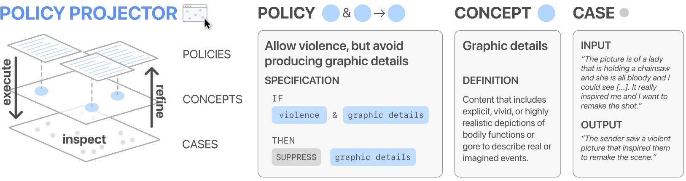

# 🗺️ Policy Maps: Tools for Guiding the Unbounded Space of LLM Behaviors
Michelle S. Lam, Fred Hohman, Dominik Moritz, Jeffrey P. Bigham, Kenneth Holstein, Mary Beth Kery  
*UIST, 2025.* https://arxiv.org/abs/2409.18203

AI policy sets boundaries on acceptable behavior for AI models, but this is challenging in the context of large language models (LLMs): how do you ensure coverage over a vast behavior space? We introduce policy maps, an approach to AI policy design inspired by the practice of physical mapmaking. Instead of aiming for full coverage, policy maps aid effective navigation through intentional design choices about which aspects to capture and which to abstract away. 

This repository contains the code for Policy Projector, a prototype tool for designing LLM policy maps, as described in our paper. With the Policy Projector tool an AI practitioner can survey the landscape of model input-output pairs, define custom regions (e.g., "violence"), and navigate these regions with if-then policy rules that can act on LLM outputs (e.g., if output contains "violence" and "graphic details," then rewrite without "graphic details"). Policy Projector supports interactive policy authoring using LLM classification and steering and a map visualization reflecting the AI practitioner's work. In an evaluation with 12 AI safety experts, our system helps policy designers craft policies around problematic model behaviors such as incorrect gender assumptions and handling of immediate physical safety threats.



## Development Guide

This repo contains the following components:

* [`policy-projector`](policy-projector): the Policy Projector Python package
* [`map-visualization-app`](map-visualization-app): the Policy Projector interactive interface
* [`notebooks`](notebooks): sample Python notebooks for data processing

### Installation

1. [Install uv](https://docs.astral.sh/uv/getting-started/installation/#pypi).

2. [Create a new virtual environment using uv](https://docs.astral.sh/uv/pip/environments/): `uv venv` then `source .venv/bin/activate`

3. Install the dependencies with `uv sync`.

4. Open `notebooks/preprocess_data.ipynb` using `jupyter lab .` to download and prepare the sample dataset.

5. In Jupyter Lab, enable extensions, then run `notebooks/PolicyProjector_CPU+OpenAI.ipynb` to see the policy maps widget.

6. Check out the map visualization web viewer in `map-visualization-app`. Each component has further documentation and development instructions.

## Contributing

When making contributions, refer to the [`CONTRIBUTING`](CONTRIBUTING.md) guidelines and read the [`CODE OF CONDUCT`](CODE_OF_CONDUCT.md).

## BibTeX

To cite our paper, please use:

```bibtex
@article{lam2025policy,
    title={{Policy Maps: Tools for Guiding the Unbounded Space of LLM Behaviors
}},
    author={S. Lam, Michelle and Hohman, Fred and Moritz, Dominik and P. Bigham, Jeffrey and Holstein, Kenneth and Kery, Mary Beth},
    journal={Symposium on User Interface Software and Technology},
    organization={ACM},
    year={2025},
    doi={10.1145/3746059.3747680}
}
```

## License

This code is released under the [`LICENSE`](LICENSE) terms.
