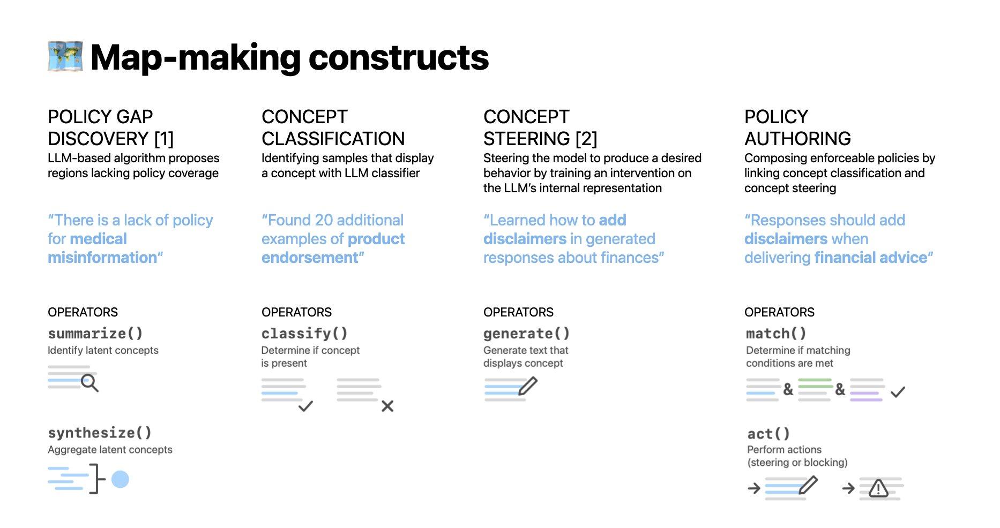

# 📽️ Policy Projector: Python Library & Jupyter Notebook Widget
With generative models, we have a vast set of model inputs and outputs—beyond what any single model policy can anticipate. *How do we help AI practitioners to design sound model policies?*
In this unbounded setting, it is helpful to approach AI policy design not as a governance task concerned with deciding what universal principles to uphold, but as a *navigational* task focused on determining what regions to support and what guidance to provide in these regions. 

We introduce Policy Projector, an interactive tool that grounds AI policy design in a task of **iterative map-making**. Our approach supports AI practitioners in (1) **exploring the model behavior landscape** and (2) **updating their custom model policy map** to cover the behaviors *most critical* to the tasks, users, and deployment contexts of *their AI feature*.

Our system allows users to populate their map by creating custom **concepts** (e.g., "medical advice," "product endorsements," "violence," "politics") that characterize notable model behaviors. These concepts form the basis of **policies** by determining *when* a policy should be invoked and *what actions* it should enforce (e.g, when the model input includes *medical advice* and a *product name*, avoid *endorsement*). The system assists users in exploring model behaviors and identifying policy gaps with a global embedding visualization that reflects the state of their concept map. 

<p align="center">

</p>

## Development guide

This directory combines several main elements:
1. Python library (which can be published as a standalone Python package on PyPI)
2. [Svelte](https://svelte.dev/) frontend components
3. [Anywidget](https://anywidget.dev/) custom jupyter widget setup (which renders the Svelte components)
4. [Vite](https://vitejs.dev/) setup to build the frontend components

### File structure
Summary of some of the main files/directories and their purposes:
- `policy_projector/`
    - `src/`
        - Python library functions
        - `__init__.py`: Handles Vite bundling and defines the widget class
    - `static/`
        - Contains results of `npx vite build`
- `widget/`
    - `index.js`: Script referenced in Vite bundling that links to the widget Svelte component that underlies the widget
    - `components/`
        - Svelte components
- `vite.config.js`: Sets up Vite bundling for Svelte + AnyWidget

### Local development
1. Install node dependencies and build the library:
   ```
   npm i
   npm run build
   ```
2. Change to *development* mode
    - Open `policy_projector/src/__init__.py`.
    - Set `__DEV` to `True`
3. Launch the local server:
    ```
    # Run from `policy-projector` top-level directory
    npx vite
    ```
4. This will launch a local server at [localhost:5173](http://localhost:5173). Keep this running to serve live updates as you modify the widget during development.
5. Now, you can test your widget in a notebook (see `notebooks/PolicyProjectorWidget.ipynb` for an example). 
    - In a separate terminal window, launch a Jupyter notebook (e.g., by running `uv run jupyter lab`)
    - Then, in the notebook, import your Python package:
        ```py
        import sys
        # Specify relative path to the Python package directory based on location of your notebook:
        sys.path.append("../policy_projector/src") 

        from policy_projector import PolicyProjector
        ```
    - Then, you can run functions that return a widget:
        ```py
        df = pd.read_csv("your_data.csv") # Load data

        pol = PolicyProjector(
            df, id_col="id", in_text_col="prompt", out_text_col="response", 
            concept_col="concepts",
            base_model_path=None, # For non-GPU testing
        )

        pol.view()  # Returns widget in cell output
        ```
6. Customize your widget!
    - Modify the input data: change the data passed in to `ComponentName` in the `vis()` function in `policy_projector/src/<library>.py`.
    - Modify the frontend: customize the frontend in HTML/CSS/JS in `src/components/ComponentName.svelte`. You can also create additional Svelte components and import them in this file.

### Production setup

#### Bundling the widget
1. Change to *production* mode
    - Open `policy_projector/src/__init__.py`.
    - Set `__DEV` to `False`
2. Build the static version:
    ```
    # Run from `policy-projector` top-level directory
    npm run build
    ```
NOTE: If already running in an active notebook using the local/development version, restart the notebook kernel and re-run notebook cells to use the production version of the widget.
